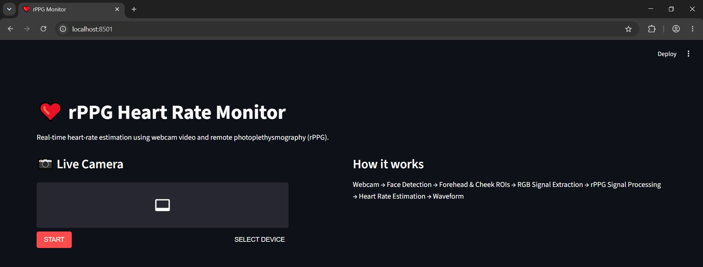
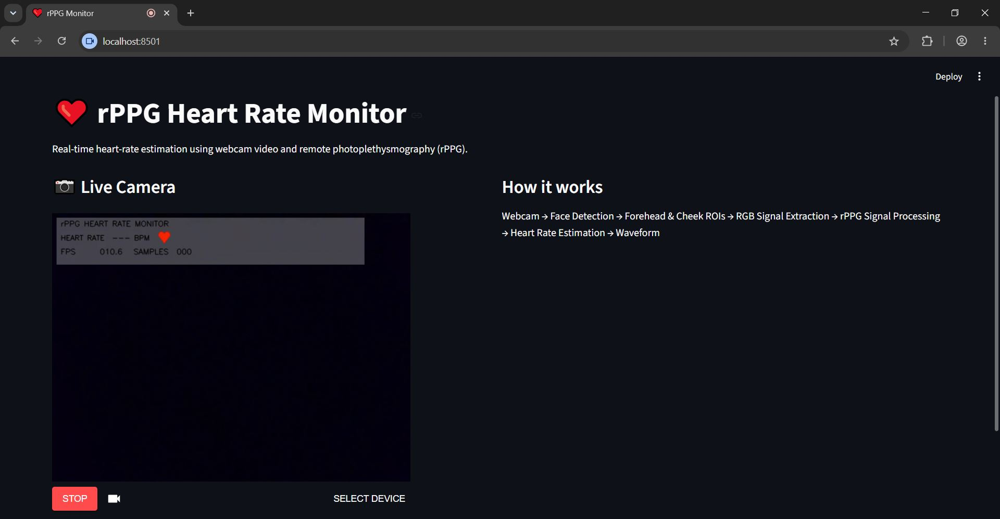

# ❤️ rPPG_Heart_Rate_Monitor

A real-time webcam-based heart-rate estimation system using **remote photoplethysmography (rPPG)**, computer vision, digital signal processing, and Streamlit.

The system estimates heart rate by detecting subtle changes in facial skin color caused by changes in blood volume. It uses the **forehead, left cheek, and right cheek** as regions of interest (ROI), extracts RGB information, processes the signal, and estimates heart rate in **beats per minute (BPM)**.

<p align="center">
  
</p>

<p align="center">
  
</p>

## About the Project

This project demonstrates how a standard webcam can be used to estimate heart rate without a physical heart-rate sensor.

The application combines:

- Face detection
- Facial ROI extraction
- RGB signal extraction
- Green-channel rPPG processing
- Signal normalization and detrending
- Butterworth band-pass filtering
- Fast Fourier Transform (FFT)
- Frequency analysis
- Multi-ROI heart-rate estimation
- Real-time waveform visualization

The application uses **Streamlit** and **streamlit-webrtc** to process webcam video in real time.

## How It Works

### 1. Capture Webcam Video

The webcam captures live video through `streamlit-webrtc`. Each incoming frame is passed to the `RPPGProcessor`, which handles face detection, ROI extraction, signal collection, heart-rate calculation, and visualization.

Audio is not used.

### 2. Detect and Track the Face

OpenCV's **Haar Cascade face detector** is used to locate the face.

The frame is converted to grayscale and resized for faster detection. If multiple faces are detected, the largest face is selected. The detected coordinates are converted back to the original **640 × 480** frame size.

Face detection is performed every few frames. Between detections, the previous face position is retained and smoothed to reduce ROI movement.

### 3. Extract Facial ROIs

Three regions are used to collect color information:

- **Forehead**
- **Left cheek**
- **Right cheek**

The forehead is selected from the upper part of the face, while the cheeks are selected from the middle-lower portion.

The average RGB value of each ROI is calculated for every processed frame and stored over time. The three measurements can also be combined by averaging their RGB values.

### 4. Process the rPPG Signal

The collected RGB data is resampled using timestamps to produce evenly spaced samples.

The system primarily uses the **green channel** for rPPG estimation.

The signal is:

1. Extracted from the green channel
2. Normalized using its average
3. Detrended to remove the overall rise or fall
4. Band-pass filtered to isolate the heart-rate frequency range

A **third-order Butterworth band-pass filter** keeps frequencies between **0.7 and 3.0 Hz**, corresponding approximately to **42–180 BPM**.

Zero-phase filtering with `filtfilt` is used to avoid phase distortion.

### 5. Calculate Heart Rate Using FFT

After filtering, a **Hanning window** is applied to reduce spectral leakage.

The **Fast Fourier Transform (FFT)** converts the signal from the time domain into the frequency domain. The power spectrum is calculated, and only frequencies between **0.7 and 3.0 Hz** are considered.

The strongest frequency component is selected as the pulse frequency.

```text
BPM = Frequency × 60
```

For example:

```text
1.2 Hz × 60 = 72 BPM
```

### 6. Multi-ROI Heart-Rate Estimation

Each facial region is processed independently:

```text
                 Face
                  │
        ┌─────────┼─────────┐
        ↓         ↓         ↓
    Forehead   Left Cheek  Right Cheek
        │         │         │
        ↓         ↓         ↓
      rPPG       rPPG       rPPG
        │         │         │
        ↓         ↓         ↓
      BPM        BPM        BPM
        └─────────┼─────────┘
                  ↓
               Median
                  ↓
          Final Heart Rate
```

Only valid BPM values are used, and their **median** becomes the final heart-rate estimate. Using multiple ROIs helps reduce the effect of noise or poor signal quality in one region.

### 7. Smooth the Heart Rate

The final BPM value is smoothed over time using exponential smoothing:

```text
New BPM = Previous BPM × 0.85 + Current BPM × 0.15
```

This prevents sudden changes and produces a more stable real-time display.

## Real-Time Visualization

The webcam interface displays:

### Heart Rate

```text
HEART RATE  72 BPM
```

If no valid estimate is available:

```text
HEART RATE  --- BPM
```

### Face and ROI Detection

A bounding box is drawn around the detected face, along with the forehead and cheek regions used for signal extraction.

### ROI Heatmap

A heatmap highlights the forehead and cheek ROIs. A blurred mask and OpenCV's `COLORMAP_MAGMA` are used to create the overlay.

### rPPG Waveform

The processed and normalized rPPG signal is displayed as a waveform above the detected face using the most recent collected samples.

### FPS and Samples

The interface also displays the video FPS and number of collected samples.

```text
FPS      29.8
SAMPLES  150
```

## Complete Processing Pipeline

```text
Webcam Video
     ↓
Face Detection & Tracking
     ↓
Forehead + Left Cheek + Right Cheek
     ↓
Average RGB Values
     ↓
Timestamp Resampling
     ↓
Green Channel
     ↓
Normalization + Detrending
     ↓
Butterworth Band-Pass Filter
     ↓
0.7 – 3.0 Hz
     ↓
Hanning Window
     ↓
FFT + Power Spectrum
     ↓
Dominant Frequency
     ↓
Frequency × 60
     ↓
ROI BPM Values
     ↓
Median
     ↓
Smoothed Heart Rate
```

### app.py

Contains the Streamlit interface and webcam configuration.

### rppg_processor.py

Handles:

* Face detection
* Face tracking
* ROI extraction
* RGB collection
* Heatmap
* Waveform
* BPM calculation

### signal_processing.py

Handles the main signal-processing functions

## Technologies Used

* **Python** – Core programming language
* **Streamlit** – Web application interface
* **streamlit-webrtc** - Real-time webcam streaming 
* **OpenCV** - Face detection, image processing, ROI visualization, and heatmaps 
* **NumPy** - Numerical operations 
* **SciPy** - Filtering and signal processing 

## Project Goal

The goal is to demonstrate a complete non-contact heart-rate estimation pipeline combining:

```text
Computer Vision
       +
Signal Processing
       +
Real-Time Video
       +
Streamlit
       ↓
Webcam-Based Heart Rate Estimation
```

This project provides a practical example of using image processing, frequency-domain analysis, and real-time Python development for webcam-based rPPG heart-rate estimation.

